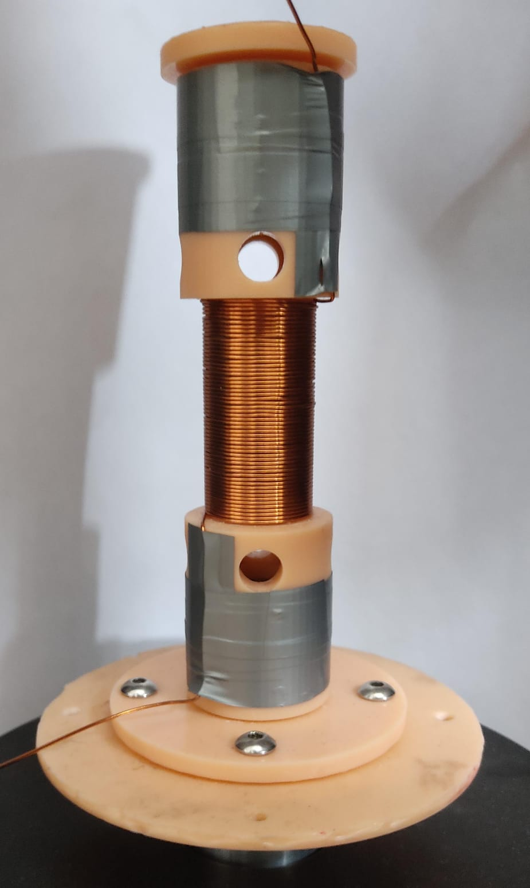

# Magnet Harvester: Полная Документация Проекта

## 1. Назначение проекта

Этот репозиторий используется для:

- моделирования линейного электромагнитного энергохаркестера (основной размер 80 мм, есть legacy-сценарии для 50 мм);
- сравнения модельных результатов с реальными экспериментами;
- построения зависимостей по частоте, скорости/начальной скорости, межмагнитному расстоянию и другим параметрам;
- подготовки агрегированных таблиц RMS и графиков для отчётов.

Проект в основном исследовательский: много исторических/экспериментальных скриптов, много сохранённых промежуточных результатов и несколько «рабочих» entrypoint-скриптов верхнего уровня.

---

## 2. Что запускать в первую очередь

Если нужна актуальная рабочая цепочка, используйте скрипты из корня репозитория:

- `main_double_magnets.py` — основной прогон модели + сравнение с экспериментальным RMS.
- `double_z_magnet_pos.py` — поиск `max(z)` по частоте.
- `main_double_magnets_save_for_freq.py` — детальный прогон на одной частоте с полным time-series.
- `main_double_magnets_delta_z.py` — пакетный прогон сетки `(freq x base_velocity)` с сохранением `timeseries/summary/meta`.
- `get_rms_table.py` — сбор общей RMS-таблицы из экспериментальных папок.

Папка `utils/` содержит в основном legacy/исследовательские скрипты.

---

## 3. Быстрый старт

### 3.1 Требования

- Python 3.10+ (проект ориентирован на Windows/PowerShell).
- Зависимости из `requirements.txt`.

### 3.2 Установка

```powershell
python -m venv .venv
.venv\Scripts\Activate.ps1
pip install -r requirements.txt
```

### 3.3 Минимальный запуск

```powershell
python main_double_magnets.py
```

После запуска результаты появятся в `graphs/experiment_<timestamp>/`.

---

## 4. Архитектура расчёта

## 4.1 Ядро модели: `model.py`

Класс: `ElectromagneticHarvesterID80mm`.

Ключевые обязанности класса:

- хранит геометрию магнитов/катушки, электрические параметры и константы;
- рассчитывает силы (магнитные, гравитация, возбуждение, сопротивления/трение);
- считает ЭДС катушки и ЭДС самоиндукции;
- решает систему ОДУ через `scipy.integrate.solve_ivp`.

Ключевые сеттеры:

- `set_frequency(hz)` — частота возбуждения;
- `set_base_velocity(v_mps)` — начальная скорость (`v0`), используется в batch-сценариях;
- `set_electrical(R_coil_ohm, R_load_ohm)` — сопротивление катушки и нагрузки.

Основной метод интегрирования:

- `solve_all(...)` возвращает:
  - `t_s` — время,
  - `z_m` — координата,
  - `v_mps` — скорость,
  - `i_A` — ток,
  - `emf_open_V` — ЭДС катушки,
  - `self_emf_V` — ЭДС самоиндукции,
  - `forces` — массив сил,
  - `v_terminal_V` — клеммное напряжение.

## 4.2 Конфигурирование

Большинство сценариев используют «константы в начале файла»:

- частоты, диапазоны, шаги;
- длительность `T_MAX_S`, частота дискретизации;
- электрические параметры;
- пути входа/выхода.

Перед запуском обычно редактируются именно эти блоки.

---

## 5. Основные сценарии (корень репозитория)

## 5.1 `main_double_magnets.py`

Назначение:

- рассчитывает модельный RMS по частотам;
- загружает эксперимент из `experiments/harvester_80mm/rms_compact_freq_rms.csv`;
- объединяет модельные и экспериментальные частоты;
- строит сравнение `model vs experiment` (raw + min-max).

По умолчанию:

- `T_MAX_S = 5.0`,
- `MODEL_FS_HZ = 1000`,
- `FREQS = np.arange(3, 22, 0.5)`,
- `RANGE_SELECT = [(7.0, 12.0)]`,
- параллельный запуск через `multiprocessing`.

Что сохраняет:

- `graphs/experiment_<timestamp>/freq_<f>/harvester_data_<timestamp>_<f>.npz`,
- `graphs/experiment_<timestamp>/freq_<f>/timeseries_<timestamp>_<f>.csv`,
- `graphs/experiment_<timestamp>/<timestamp>_results_model_raw.csv`,
- `graphs/experiment_<timestamp>/<timestamp>_model_experiment_minmax.csv`,
- `graphs/experiment_<timestamp>/rms_vs_freq_minmax_<timestamp>.png`,
- `graphs/experiment_<timestamp>/self_induction_rms_<timestamp>.png`,
- `graphs/experiment_<timestamp>/self_induction_minmax_<timestamp>.png`.

## 5.2 `double_z_magnet_pos.py`

Назначение:

- прогон по частотам;
- вычисление `max(z)` и `max(|z|)` для центра магнита;
- построение графика зависимости максимального смещения от частоты.

Что сохраняет:

- `graphs_center_pos/experiment_<timestamp>/freq_<f>/harvester_center_pos_<...>.npz`,
- `graphs_center_pos/experiment_<timestamp>/<timestamp>_center_magnet_pos_vs_freq.csv`,
- `graphs_center_pos/experiment_<timestamp>/center_magnet_pos_vs_freq.png`.

## 5.3 `main_double_magnets_save_for_freq.py`

Назначение:

- детальный прогон одной частоты (`FREQ_HZ`);
- сохранение полного временного ряда и диапазонов (`min/max/ptp`).

Что сохраняет:

- `graphs/single_freq_<timestamp>_f<freq>Hz/timeseries_emf_position_velocity.csv`,
- `graphs/single_freq_<timestamp>_f<freq>Hz/summary_ranges.csv`,
- графики `position_velocity.png`, `emf_and_terminal_voltage.png`, `current.png`.

## 5.4 `main_double_magnets_delta_z.py`

Назначение:

- batch-сетка по `(FREQS x VELOCITIES)`;
- для каждой точки пишет отдельную папку с time-series, summary и метой.

Текущий дефолт в файле:

- `FREQS = [10.6]`,
- `VELOCITIES = [0, 0.6, 1.2]`,
- `OUT_ROOT = D:/PROJECTs/magnet/harvester/experiments/harvester_80mm_v2/exp3`.

Формат результата для точки:

- `.../f<freq>hz_v<vel>/timeseries.csv`,
- `.../f<freq>hz_v<vel>/summary_ranges.csv`,
- `.../f<freq>hz_v<vel>/meta.txt`.

## 5.5 `get_rms_table.py`

Назначение:

- собирает RMS-таблицу из нескольких источников экспериментов;
- умеет читать как `exp_*/data`, так и прямой `data/`;
- каждая серия эксперимента становится отдельной колонкой.

По умолчанию источники:

- `experiments/harvester_50mm_ID1`,
- `experiments_reversed/harvester_50mm_ID1`.

Ключевые CLI-опции:

- `--only-common` — оставить только общие частоты;
- `--center` — RMS после вычитания среднего;
- `--output <path>` — путь к CSV;
- `--no-save` — только печать в консоль.

Пример:

```powershell
python get_rms_table.py --only-common --center --output rms_table.csv
```

## 5.6 Подпроект `magnet_force/`

Назначение:

- аппроксимация/сравнение моделей силы взаимодействия магнитов по лабораторным данным.

Основной скрипт:

- `magnet_force/main.py` читает `exp2.csv`, подгоняет модель(и), сохраняет:
  - `fit_comparison_exp1.png`,
  - `fit_results_exp1.txt`.

В папке уже есть сохранённые результаты и CSV измерений (`exp1.csv`, `exp2.csv`).

---

## 6. Где что хранится

Ниже смысл директорий (на текущем состоянии репозитория):

```text
.
├─ model.py                         # ядро модели 80 мм
├─ main_double_magnets*.py          # актуальные сценарии расчёта
├─ double_z_magnet_pos.py           # sweep max(z)
├─ get_rms_table.py                 # сборщик RMS таблицы
├─ requirements.txt
├─ magnet_force/                    # отдельный мини-проект по силе магнитов
├─ experiments/                     # исходные измерения + модельные batch-результаты
│  ├─ harvester_50mm/
│  ├─ harvester_50mm_ID1/
│  ├─ harvester_80mm/
│  ├─ harvester_80mm_v2/
│  └─ model_numerical_80mm/         # сетки f/v с timeseries.csv, summary_ranges.csv, meta.txt
├─ experiments_reversed/            # reverse-эксперименты (в основном 50 мм)
├─ graphs/                          # итоговые графики/CSV от прогонов
├─ logs/                            # архив логов и промежуточных результатов
├─ last_exp/                        # рабочая папка прошлых экспериментов/выгрузок
├─ utils/                           # legacy и вспомогательные скрипты
└─ __pycache__/                     # кэш Python
```

### 6.1 Данные экспериментов (`experiments/*/exp_*/`)

Типичный набор подпапок:

- `data/` — сырые CSV измерений;
- `synthesized_data/` — синтезированные/подготовленные сигналы для шейкера;
- `logs/` — локальные промежуточные результаты;
- `analysis/` или `min_max_results/` — дополнительные производные расчёты.

### 6.2 Результаты модели

Основные места:

- `graphs/experiment_<timestamp>/...` — результаты `main_double_magnets.py`;
- `graphs/single_freq_<timestamp>_f.../` — результаты `main_double_magnets_save_for_freq.py`;
- `graphs_center_pos/experiment_<timestamp>/` — результаты `double_z_magnet_pos.py`;
- `experiments/model_numerical_80mm/...` — крупные batch-сетки.

### 6.3 Архивные/служебные

- `logs/`, `last_exp/` содержат большие исторические выгрузки.
- `.gitignore` исключает `logs/`, `graphs/`, `delta_params/`, `experiments/`, `experiments_reversed/`, `last_exp/`.

---

## 7. Форматы данных

## 7.1 Сырые CSV эксперимента (`exp_*/data/*.csv`)

Чаще всего:

- без заголовка;
- `sep=";"`,
- десятичный разделитель `,`.

Типичная разметка каналов (по используемым utility-скриптам):

- колонка `0` — ток (часто анализируется как current),
- колонка `1` — сигнал напряжения/канал 2,
- колонка `2` — ускорение (или соответствующий канал),
- колонка `3` — ЭДС (основной канал для RMS-сравнений).

Важно: единицы зависят от конкретного эксперимента и калибровки; в нескольких скриптах ЭДС из `data/*.csv` трактуется как `mV` и переводится в `V`.

## 7.2 Компактный RMS-файл

`experiments/harvester_80mm/rms_compact_freq_rms.csv`:

```csv
freq_Hz,rms_emf_mV
2.0,0.7925...
...
```

Файл используется как основной экспериментальный baseline в `main_double_magnets.py`.

## 7.3 `timeseries.csv` модельных точек

Типичные колонки:

- `t_s`,
- `z_m`,
- `v_mps`,
- `emf_open_V`,
- `emf_self_V`,
- `v_term_V`,
- `i_A`.

## 7.4 `summary_ranges.csv`

Типичные колонки:

- `name`,
- `unit`,
- `min`,
- `max`,
- `ptp`.

## 7.5 `meta.txt`

Обычно включает:

- `freq_hz`,
- `base_velocity`,
- `T_MAX_S`,
- `FS`,
- `timestamp`.

---

## 8. Каталог `utils/` (legacy и вспомогательные инструменты)

Ниже перечислены все Python-скрипты в `utils/` с кратким назначением.

### 8.1 Модели и базовые классы

- `ElectromagneticHarvester50.py` — модель харвестера 50 мм.
- `ElectromagneticHarvesterID50mm_ERZHANAT.py` — вариант абсолютной модели 50 мм.
- `ElectromagneticHarvesterID80mm.py` — legacy-модель 80 мм с поддержкой загрузки базы из CSV.
- `ElectromagneticHarvesterID80mm_gpu.py` — вариант/эксперименты для ускоренного расчёта.
- `models.py` — набор вспомогательных классов/формул (магнит, геометрия и т.д.).

### 8.2 Legacy main/scenario-скрипты

- `main.py` — ранний прототип моделирования.
- `main_fast.py` — ускоренный legacy-вариант.
- `main_EMH.py` — сравнение модели и одного эксперимента (80 мм).
- `main_EMHp.py` — пакетный вариант `main_EMH.py` для набора экспериментов.
- `main_f_rms.py` — график RMS по частоте (модель vs эксперимент).
- `main_real.py` — параллельный сценарий RMS/мощность/таблицы по диапазону частот.
- `main_RMS_F.py` — расширенный сценарий RMS и таблиц с загрузкой шейкера.
- `main_RMS_F_WITH_GENERATOR.py` — версия с генератором синус-возбуждения.
- `all_params.py` — массовый перебор параметров (Br, c) с оценкой RMS.
- `approx.py` — обработка набора файлов + подбор параметров по ошибке.
- `find_amplitude.py` — подбор амплитуды возбуждения по частотам.
- `find_high_emf_deltax.py` — поиск режимов с высокой ЭДС (legacy).
- `find_high_self_emf.py` — поиск режимов с высокой самоиндукцией (legacy).
- `main_3d.py` — 3D sweep по параметрам (влияние геометрии/частоты).
- `main_3d_80mm.py` — инкрементальный 3D sweep для 80 мм.
- `main_3d_80mm_delta_vz.py` — карта по `(z0, v0)` при фиксированных настройках.
- `main_3d_absolute.py` — 3D sweep с логикой сравнения с экспериментом.

### 8.3 Аналитика, визуализация, постобработка

- `show_acc.py` — графики/оценка ускорения по экспериментам.
- `show_current.py` — графики тока из сырых CSV.
- `show_amplitude_exp.py` — извлечение амплитуд по экспериментам.
- `show_experiments.py` — сводные графики forward/reversed экспериментов.
- `show_experiments_v2.py` — улучшенный/альтернативный сводный просмотр.
- `show_graph_exp.py` — сравнение модель/эксперимент с метриками ошибок.
- `show_rms_model_and_teory.py` — сопоставление RMS моделей и теории.
- `rms_multiexp_plot.py` — RMS по нескольким сериям экспериментов.
- `polinum_rms.py` — полиномиальная аппроксимация RMS-зависимостей.
- `power_self_induction_table.py` — таблицы мощности и вклада самоиндукции.
- `visualize_experiment_results.py` — визуализация сохранённых 3D результатов.
- `visualize_experiment_combine.py` — комбинированная версия визуализации.
- `visualize_results_strict.py` — строгое сравнение model/exp по CSV.
- `fft_harvester_plot.py` — FFT-анализ сигналов.
- `fft_best_ampl.py` — подбор/оценка амплитуд через FFT.
- `calc_velocity.py` — интегрирование ускорения в скорость для CSV.
- `get_min_max_velocity.py` — расчёт min/max по скорости в наборах.
- `model_vs_exp.py` — старое сравнение модель vs эксперимент.
- `exp_vs_exp.py` — сравнение двух экспериментальных наборов.
- `teory_vs_teory.py` — сравнение теоретических конфигураций.

---

## 9. Примеры рабочих запусков

### Сравнить модель и эксперимент по RMS

```powershell
python main_double_magnets.py
```

### Построить `max(z)` по частотам

```powershell
python double_z_magnet_pos.py
```

### Сохранить полный time-series на одной частоте

```powershell
python main_double_magnets_save_for_freq.py
```

### Прогнать сетку `freq x velocity`

```powershell
python main_double_magnets_delta_z.py
```

### Собрать RMS-таблицу из каталогов экспериментов

```powershell
python get_rms_table.py --only-common --center --output rms_table.csv
```

---

## 10. Частые проблемы

- Кодировка текста в консоли Windows может показывать «кракозябры» в русских комментариях. Сами скрипты обычно работают корректно.
- Во многих legacy-скриптах в `utils/` зашиты абсолютные пути вида `D:\PROJECTs\...`; перед запуском их нужно править.
- Некоторые папки (`graphs`, `logs`, `last_exp`, `model_numerical_80mm`) очень большие; прогон/индексация может занимать заметное время.
- В проекте много исторических скриптов с похожими задачами; для новой работы лучше использовать сценарии из корня репозитория (раздел 5).

---

## 11. Рекомендуемый порядок для новой серии экспериментов

1. Сложить сырые CSV в `experiments/<dataset>/exp_<n>/data/`.
2. При необходимости подготовить `synthesized_data/`.
3. Сгенерировать RMS baseline (или обновить `rms_compact_freq_rms.csv`).
4. Запустить `main_double_magnets.py` для сравнения model vs experiment.
5. Для точечной диагностики запустить `main_double_magnets_save_for_freq.py`.
6. Для карт по сетке параметров запустить `main_double_magnets_delta_z.py`.
